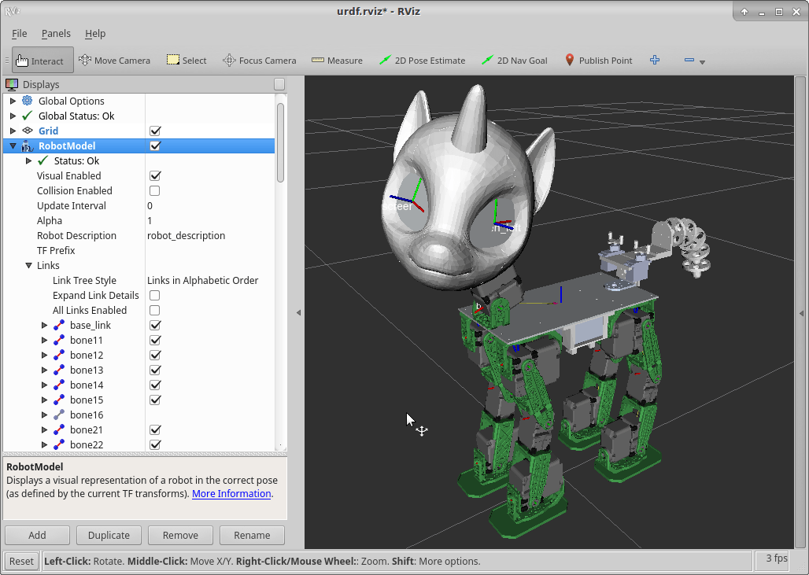

# Proto2 URDF robot model with meshes and rviz configuration file.
This package is part of [Sweetie Bot project](http://sweetiebot.net).

This package contains the description (mechanical, kinematic, visual, etc.) of the Sweetie Bot Proto2 robot.

## Files
`urdf/sweetie_bot_proto2_description.urdf` --- robot model in [Unified Robot Description Format (URDF)](http://wiki.ros.org/urdf/Tutorials).

`urdf/fix_files.py` --- Script to fix newly created URDF files (usually you don't need it).

`meshes/` --- mesh files for visualization and collision properties.

`urdf.rviz` --- Rviz config file.

## Testing
To use robot model just include `description.launch` to your launch file:

```
<include file="$(find sweetie_bot_proto2_description)/launch/description.launch" />
```

To view the model standalone, use the launcher:
```
roslaunch sweetie_bot_proto2_description display.launch
```
## Troubleshooting
If you experienced problems with 3d model loading try to set `export LC_NUMERIC="C"` or change to `sweetie_bot_proto2_description_stl.urdf` in `description.launch`


